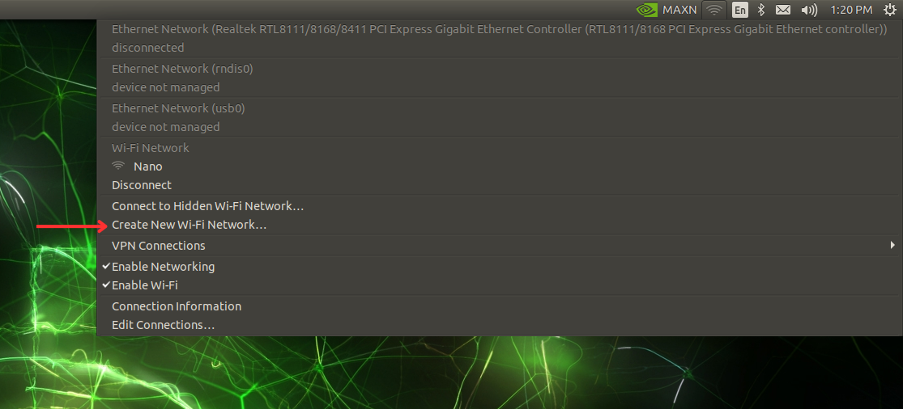
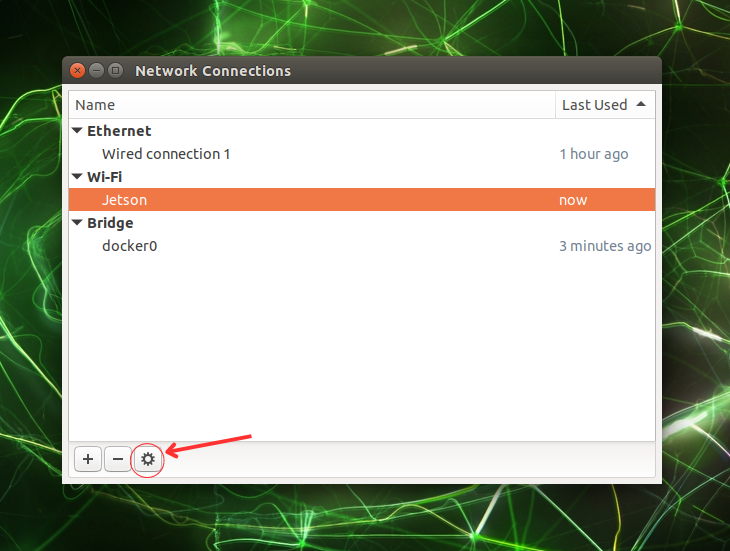
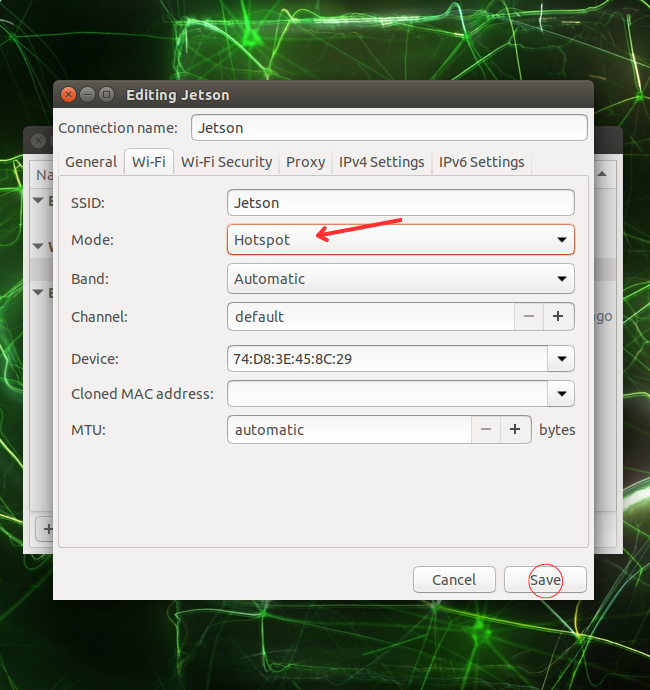
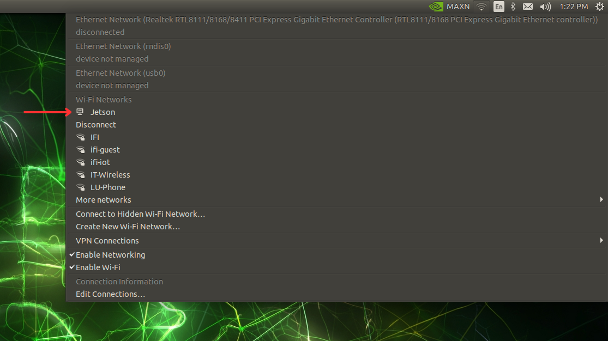

## Set-Up the VEX AI Web Dashboard

***If you built your Jetson Nano SD card image from source, you will need to fololow these instructions, otherwise if you used the provided VEX AI SD card image, you can skip this section***

The VEX AI Web Dashboard allows you to see real-time camera, depth, object position, and Jetson statistic data by connecting to a webserver hosted on the Jetson. We turn the Jetson into an access-point (hotspot) and can connect to its Wi-Fi network like any other to connect to this server.

You can see the section below on how to start an Access Point on your Jetson Nano.

To prepare your Jetson to run the Web Dashboard, follow these steps:

**The Web Dashboard is built in React, you will need to install node.js**
```
sudo apt-get update
sudo apt-get upgrade
sudo apt install nodejs
sudo apt install npm
```

**Restart your Jetson**
```
sudo npm cache clean -f
sudo npm install -g n
sudo n 16
```

**Navigate to the folder containing the web dashboard (`vexai-web-dashboard-react`)**

`npm install`

To build the WebServer:
- Run `npm run build` to build the react app
- Run `sudo npm install -g serve` to install the serve npm package. 
- At the root of the repository, run `serve -s build` to serve the static build files
- Navigate to `http://10.42.0.1:3000/#/` in a browser connected to your Jetson Nano


## Starting Jetson Access Point

**How to start a Jetson AP Hot-spot to connect to the VEX AI Web Dashboard**

***(Make sure you have a wifi card installed in your Jetson Nano)***

1. Click and open the connections menu from the top menu bar


2. Create a New Wi-Fi Network



3. Name your network and pick your Wi-Fi security level (None recommended) and click *Create*


4. Open the *"Edit Connections:* Menu


5. Select your Network Name and open the settings menu by clickling on the gear icon



6. Change the **Mode** from *"Ad-hoc"* to ***"Hotspot"***




Click ***Save*** to close

7. Connect to your newly created Wi-Fi Network


8. Select the Wi-Fi Network Name that you want to connect to


9. If you see the Wi-Fi Name as Connected, you are successfully broadcasting from your Jetson!
You can connect like any other network from the device you want to run the web dashboard from.


